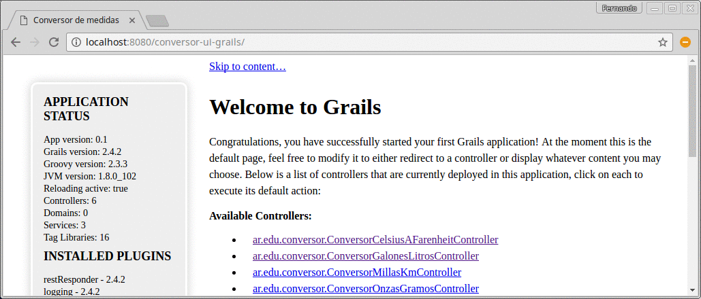

# Conversor genérico en Grails

## Explicación general
En el [capítulo específico de este apunte](https://docs.google.com/document/d/1g9Q7TxWU5hJu6_V8r63eSCek1EC1PCTL-f310XzDANE/edit#heading=h.5slbq2o2ct46) 
está la explicación de la conversión que permite convertir

* de onzas a gramos
* de galones a litros
* de millas a kilómetros

## Conceptos que se ven en el ejemplo

* Templates del lado server de la vista, 
* Tiene un controller abstracto que instancia distintos tipos de conversores, manteniendo así las cosas __en un solo lugar__

## Versiones actuales

* Grails 2.4.2
* en un entorno GGTS 3.6.0
* con Twitter Bootstrap 3.2.0

